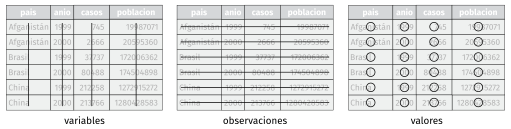

```{r setup, include=FALSE}
knitr::opts_chunk$set(echo = TRUE)

```

## El paquete **_tidyverse_**

En inglés se usa el adjetivo _tidy_  para señalar que algo esta ordenado, o sea estructurado de una cierta manera.
El paquete _tidyverse_ ayuda a trabajar de manera ordenada con los datos. 
 _tidyverse_ está compuesto por muchos paquetes distintos, cada uno con funciones especiales para ayudar a ordenar y analizar datos de manera ordenada. 

Cargamos ahora _tidyverse_ y vemos qué paquetes trae:

```{r tidyverse}
library(tidyverse)
```

## Datos ordenados

Cuando hablamos de datos en tablas, estos datos están ordenados, _tidy data_, si y sólo si:

- Cada variable debe tener su propia columna.
- Cada observación debe tener su propia fila.
- Cada valor debe tener su propia celda.



---
## Tibbles

Para las tablas _tidyverse_ usa **_tibble_** que es un dataframe ordenado.
Miremos el dataset _iris_ que viene con R y descubramos sus particularidades:

```{r iris}
iris
```

Si unimos con lo anterior,  
- cada dataset a usar dentro de un mismo análisis debe estar en su propia tibble.
---
## El paquete **_readr_**

- Lee archivos de texto planos formateados de distinta manera (hay que ver separador de columnas y decimales)
- deduce el tipo de dato de cada columna y lo imprime
- Devuelve siempre una tibble
- Tiene funciones especiales para resolver problemas de codificación

---
##  Importando datos tabulares segun su delimitador

Vamos a importar el dataset  terremotos.cvs pero antes lo miramos para ver como estan separados los decimales y las columnas.

Si las columnas estan delimitadas con ","  y los decimales con  ".",  usamos `read_csv`

```{r cvs}
T1 <- read_csv("terremotos.csv")
```
Vemos como entraron los datos
```{r T1}
T1
```
---
## Funciones para leer achivos
- read_csv()      columnas con , decimal con .
- read_csv2()     columnas con ; decimal con ,
- read_delim()    columnas con delimitador personalizado, ej delim = "|"

```{r csv2}
T2 <- read_csv2("terremotos2.csv")
```

```{r T2}
T2
```
---
```{r delim_a}
T3a <- read_delim("Terremotos3.txt", delim = "|")
```
```{r T3a}
T3a
```
```{r delim_b}

T3b <- read_delim("Terremotosb.prn", delim = " ")
```
```{r T3b}
T3b
```

---

## Perlitas

- skip = n                   saltea n lineas antes de empezar a leer
- n_max = n                  solo lee n filas
- col_names = FALSE          le pone nombres de columna genericos a las filas
- na = "."                   si donde no tenemos datos hay un . rellena el valor con NA
- skip_empty_rows= TRUE      saltea lineas sin datos
- archivos terminados en .gz, .bz2, .xz, or .zip son descomprimidos automaticamente.
- archivos que empiezan con  http://, https://, ftp://, o ftps:// se descargan automaticamente. 

---

## Funciones para guardar archivos planos (tablas en texto)

Son similares a las de leer 

- write_csv()
- write_csv2()
- write_delim()

```{r write}
write_delim(T3a, "Terrem.txt", delim = "|", na = "NA", append = FALSE)
```

## Archivos excel con **_readxl_**

Para leer archivo excel hay que agregar otro paquete, que no se carga por defecto
```{r readxl}
library(readxl)
```

Con este paquete se pueden importar datos de excel que esten "prolijitos" y tambien guardar en este formato

-read_excel(), read_xls() , read_xlsx()
```{r excel}
T4 <- read_excel("Terremotosb.xlsx")
```

```{r T4}
T4
```
## Archivos ods con **_readODS_**

Hay que instalar el paquete **readODS** y cargar las librerias
Sirve para leer y para eneste formato

```{r}
#ya lo tengo instalado
library(readODS)

```


```{r ods}
T5 <- read_ods("Terremotos_tab.ods")
```

```{r T5}
T5
```

